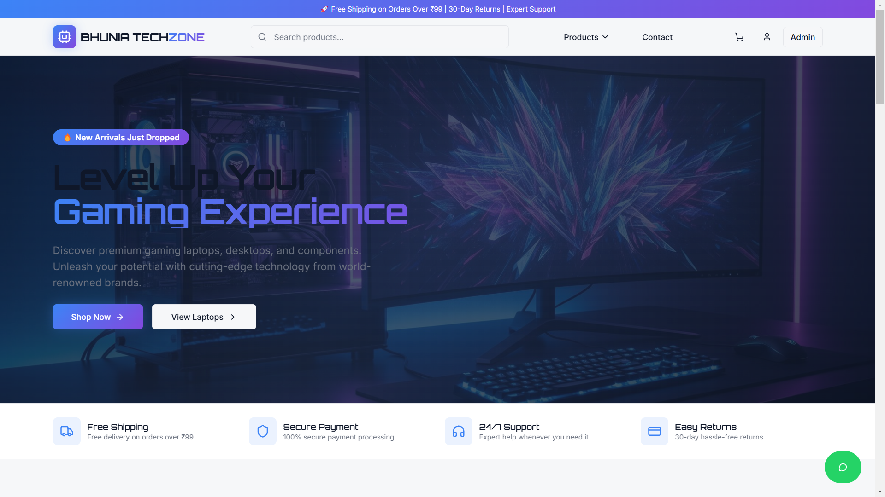
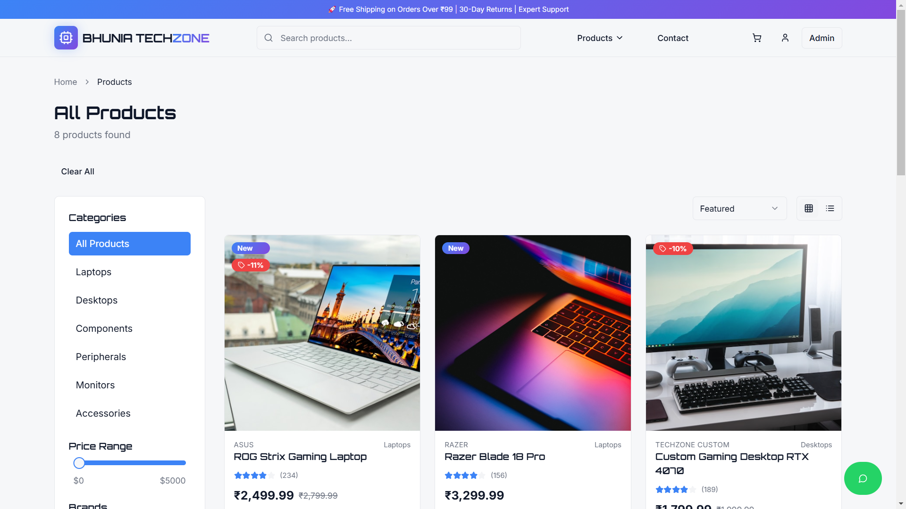
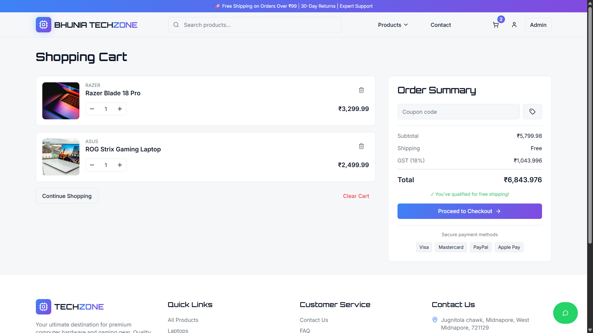
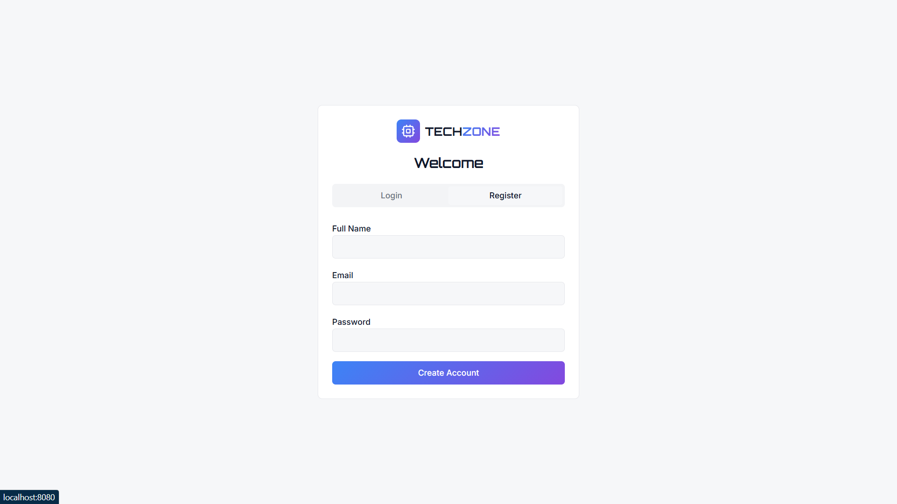

# 🖥️ Bhunia TechZone


**Bhunia TechZone** is a modern, responsive **e-commerce web application** focused on computer hardware and gaming accessories.  
The project demonstrates **real-world frontend architecture**, reusable components, protected routes, and modern UI/UX practices using the latest React ecosystem.

---

## 🌐 Live Links

- **Live Website:**  
  [https://bhunia-tech-git-main-darksuns-projects.vercel.app](https://bhunia-tech.vercel.app/)

- **GitHub Repository:**  
  https://github.com/Darksun-Dyuti/bhunia-tech

---

## ✨ Key Features

- 🛒 Browse gaming laptops, desktops, components & peripherals
- 🔍 Search products with category-based filtering
- 🧺 Cart management with quantity updates
- 💳 Checkout flow with order success page
- 🔐 Admin dashboard with protected routing
- 📱 Fully responsive UI (mobile, tablet & desktop)
- ⭐ Customer reviews & testimonial section
- 📩 Newsletter subscription UI
- 🌐 Social media & GitHub links in footer
- 🚀 CI/CD with automatic deployment on Vercel

---

## 🛠️ Tech Stack

**Frontend**
- React 18
- TypeScript
- Vite

**Styling & UI**
- Tailwind CSS
- shadcn/ui
- Lucide React Icons
- React Icons

**Routing & State**
- React Router DOM
- React Context API

**Deployment**
- Vercel

---

## 📁 Project Structure

```bash
bhunia-tech/
├── components/
│ └── layout/
│ ├── Header.tsx
│ └── Footer.tsx
├── context/
│ └── CartContext.tsx
├── pages/
│ ├── Index.tsx
│ ├── Products.tsx
│ ├── ProductDetail.tsx
│ ├── Cart.tsx
│ ├── Checkout.tsx
│ ├── OrderSuccess.tsx
│ ├── Auth.tsx
│ └── Admin.tsx
├── screenshots/
│ ├── home.png
│ ├── products.png
│ ├── cart.png
│ └── admin.png
├── App.tsx
├── main.tsx
├── package.json
└── README.md
```

---

## 🚀 Getting Started (Run Locally)

### 1️⃣ Clone the repository
```bash
git clone https://github.com/Darksun-Dyuti/bhunia-tech.git
cd bhunia-tech
```

### 2️⃣ Install Dependencies
```bash
npm install
```

### 3️⃣ Start Development Server
```bash
npm run dev
```

**Open in browser:**
👉 http://localhost:5173

---

## 📸 Screenshots

Below are some screenshots of the application showcasing the UI and features.






## 🎯 Project Motivation

This project was built to:

- Understand **real-world React project structure**
- Practice **component-based architecture**
- Learn **client-side routing & protected routes**
- Implement **state management using Context API**
- Gain hands-on experience with **Vercel deployment**
- Simulate a **production-like e-commerce workflow**

---

## 📚 Learning Outcomes

Through this project, I learned:

- Building scalable React applications using Vite
- Managing global state (cart, UI) with Context API
- Implementing protected routes and admin access
- Handling SPA routing and 404 issues correctly
- Deploying and debugging production apps on Vercel
- Working with modern UI libraries and Tailwind CSS
- Using Git & GitHub for real development workflows

---

## 👤 Author

**Dyutimoy Bhunia**

- GitHub: https://github.com/Darksun-Dyuti
- Instagram: https://www.instagram.com/darksun_dyuti/
- Twitter / X: https://x.com/darksun_dyuti
- Discord: darksun_dyuti

---

## ⭐ If you like this project, please consider starring the repository!
